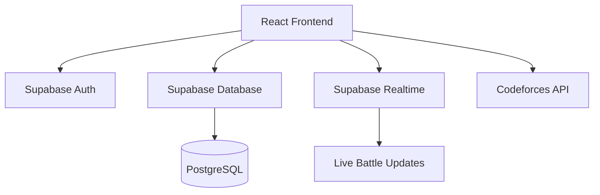
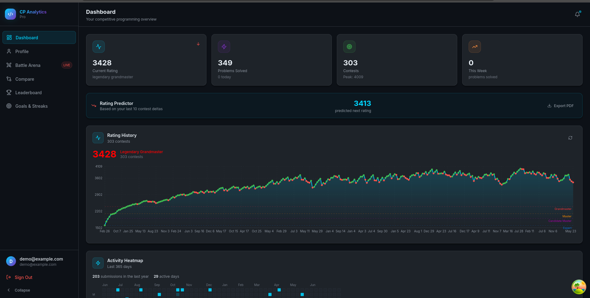
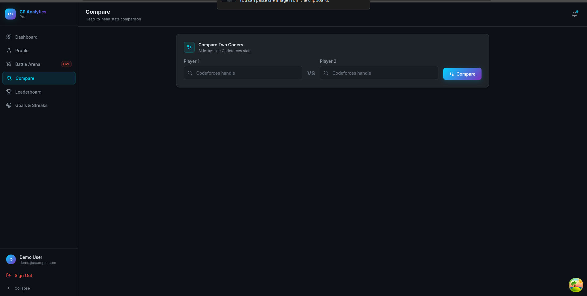
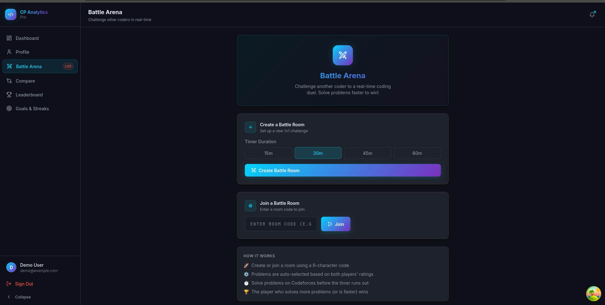

# CP Analytics Pro 🏆

An advanced competitive programming analytics platform designed to help you track performance, identify weaknesses, and challenge peers in real-time.


## 🚀 Features

-   **🔐 Secure Authentication**: Integrated with Supabase Auth for seamless login/signup.
-   **📊 Dynamic Dashboard**: Visualize your Codeforces rating history, contest performance, and problem-solving heatmap.
-   **🧠 Smart Insights**: Automated analysis of your solving patterns to detect strengths and weaknesses.
-   **⚔️ Real-Time Battles**: Challenge friends to a 1v1 coding battle with live synchronization and scoreboards.
-   **🎯 Goal Tracking**: Set rating targets and track your progress with estimated time to achievement.
-   **🔥 Streak System**: Stay consistent with daily problem-solving streaks and visualizations.
-   **🏆 Global Leaderboard**: Compete for the top spot on the global rankings.
-   **🆚 User Comparison**: Compare your stats side-by-side with any other Codeforces user.

## 🛠️ Tech Stack

-   **Frontend**: React (Vite), TypeScript, Tailwind CSS
-   **BaaS**: Supabase (PostgreSQL, Auth, Realtime)
-   **Charts**: Recharts
-   **State Management**: Zustand, React Query
-   **Icons**: Lucide React
-   **Animations**: Framer Motion

## 📦 Setup Instructions

### 1. Prerequisites
-   Node.js (v18+)
-   A Supabase Project

### 2. Environment Variables
Create a `.env` file in the root directory and add your Supabase credentials:
```env
VITE_SUPABASE_URL=your_supabase_url
VITE_SUPABASE_ANON_KEY=your_supabase_anon_key
```

### 3. Database Setup
1.  Go to your Supabase SQL Editor.
2.  Copy the contents of `supabase/schema.sql` and run them.
3.  Ensure Realtime is enabled for `battles`, `battle_participants`, and `battle_submissions` (included in the script).

### 4. Installation & Development
```bash
# Install dependencies
npm install

# Start development server
npm run dev
```

## 📐 Architecture



## 📸 Screenshots

<div align="center">
  <h3>📊 Dashboard & Analytics</h3>
  
  <br/><br/>
  <div style="display: flex; gap: 10px; justify-content: center;">
    
    
  </div>
</div>

## 📄 License
MIT License - see [LICENSE](LICENSE) for details.
